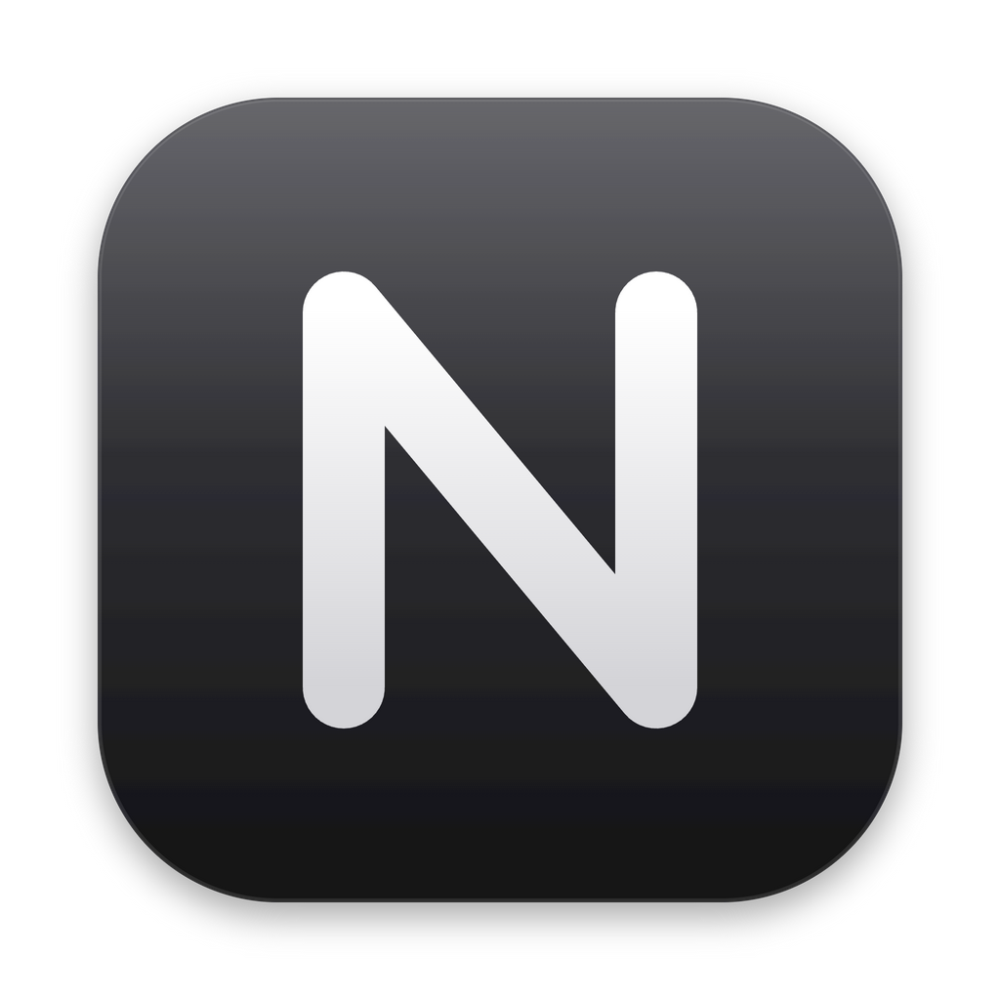

<div align="center">



# Noe Agent

**All your AI coding assistants in one chat app: one-click install, multi-provider API management, chat with any AI one-on-one, or drag several AIs into a group and whoever you @ gets to work.**

[简体中文](README.md) | English


</div>

> [!WARNING]
> **This is a beta and still has rough edges.** Bug reports and ideas are welcome in [Issues](https://github.com/haha362636-coder/noe-agent/issues).

## Language

The app ships in **English** and **简体中文**. On first launch it follows your system language; switch any time with the globe button at the bottom left, or in **Settings → Language**. The interface, system messages, command replies and the prompts Noe sends to the AIs all switch together, so the AIs answer in your language too.

## Install (macOS)

Download the build for your chip from [Releases](https://github.com/haha362636-coder/noe-agent/releases):

| Your Mac | Download |
|---|---|
| Apple silicon (M1 / M2 / M3 / M4 …) | `Noe-Agent-<version>-mac-arm64.dmg` |
| Intel | `Noe-Agent-<version>-mac-x64.dmg` |

> Not sure which one you have? Click  → **About This Mac**. If **Chip** says Apple M…, it's Apple silicon; if it says Intel, it's Intel.

Open the dmg and drag **Noe Agent** into **Applications**. The app is not notarized by Apple, so if the first launch says it is "damaged" or "from an unidentified developer", run this once in **Terminal**:

```bash
xattr -cr "/Applications/Noe Agent.app"
```

Then open it normally. Requires macOS 12 or later; the built-in terminal uses the system `python3` (macOS will offer to install the Command Line Tools if it's missing).

## Install (Windows)

> [!NOTE]
> The Windows build is newer and earlier-stage than the Mac build. If you hit a problem, please open an [issue](https://github.com/haha362636-coder/noe-agent/issues) with a screenshot and your Windows version.

Download from [Releases](https://github.com/haha362636-coder/noe-agent/releases):

| File | What it is |
|---|---|
| `Noe-Agent-<version>-win-x64-setup.exe` | Installer (recommended), creates desktop and Start menu shortcuts |
| `Noe-Agent-<version>-win-x64.zip` | Portable, unzip and run `Noe Agent.exe` |

**1. Install two prerequisites** (Noe Agent installs the AI tools with npm):

- [Node.js](https://nodejs.org) (LTS, just click Next)
- [Git for Windows](https://git-scm.com/download/win) (Claude Code on Windows needs the Git Bash it ships with)

**2. Install Noe Agent**: run `setup.exe`. It isn't code-signed, so if you see "Windows protected your PC", click **More info** → **Run anyway** (first time only).

**3. Start using it**: open Noe Agent from the desktop or Start menu, then install Claude Code and friends in one click on the **AI Tools** page.

Requires Windows 10 (1809+) or Windows 11, 64-bit; Windows on ARM works through the built-in emulation. Differences from the Mac build: shortcuts use `Ctrl` (e.g. `Ctrl+K`, `Ctrl+J`), the built-in terminal defaults to PowerShell, and data lives in `C:\Users\<you>\.noe-agent`.

## Features

- **AI Arena (new)**: give the same task to several AIs at once. Each one works in its own copy of your project, so they can't get in each other's way. Judging is blind by default (you only see "Contestant A / B / C"): compare the answers, the files they changed, time and cost side by side, with the fastest and cheapest marked for you. Identities are revealed after you pick a winner, and only the winner's changes are merged into your working folder, undoable in one click with the Time Machine. Wins add up on a leaderboard. In a group, click **Arena** under the input box or type `/arena <task>`; in a direct chat, use `/arena <task> @codex` to bring other AIs in.
- **Multilingual (new)**: English and Simplified Chinese, switchable from the globe button or Settings. System messages, command replies and the prompts sent to AIs follow the selected language.
- **AI tools**: one-click install / update / uninstall for Claude Code, Codex, DeepSeek Harness, Gemini CLI, Qwen Code and OpenCode, with official sign-in status; plug in any custom CLI.
- **Providers**: presets for Anthropic, OpenAI, DeepSeek, Zhipu GLM, Kimi, Alibaba Bailian, MiniMax, OpenRouter, SiliconFlow and Gemini, plus any compatible API; connection tests and model list fetching.
- **One-click switching**: every AI can switch between its official sign-in and any provider API at any time (tool card, chat header, or `/use`).
- **Model picker**: built-in catalog of the latest models (Claude Fable 5.1 / Opus 5.5 / Sonnet 5.5, Gemini 3.8 Flash, …; Codex's list is read live, e.g. GPT-6.1 Sol / GPT-6 Astra), searchable, or type any model ID; reasoning effort for Claude Code and Codex. Fuzzy matching: `/model opus 5.5`, `/model gpt-6`.
- **Chats & groups**: chat with any AI, or drag AIs into a group and assign work with @; AIs can @ each other to hand off. Markdown with code highlighting, a step-by-step timeline, and duration / token / cost stats.
- **Time Machine**: every AI reply records which files it changed. View diffs and undo / redo in one click, for every AI (snapshots are stored separately and never touch your project's own Git).
- **Working folders**: pick a project folder for each new chat so you always know where the output goes; file links in replies open in your default app.
- **/ commands**: `/help /arena /login /logout /use /model /effort /status /terminal /shell /new /clear /stop /cwd /invite /kick /rename`; commands that need an interactive UI (like Claude's `/config` or `/mcp`) open in the built-in terminal.
- **Built-in terminal**: a real pseudo-terminal for official sign-ins, interactive commands and resuming sessions (Mac ⌘J / Windows Ctrl+J).
- **MCP servers**: 20 popular presets (Filesystem, Context7, GitHub, Playwright, Chrome DevTools, Tavily, AMap, Notion, …) installed into several AI tools at once; a matrix to sync or remove what's installed; custom servers and JSON import.
- **Plugins**: the Claude Code plugin marketplace (300+ plugins), Codex plugins and Gemini CLI extensions, with one-click install / enable / uninstall.

## Run from source

Requires Node.js 18+.

```bash
git clone https://github.com/haha362636-coder/noe-agent.git
cd noe-agent
npm install      # installs Electron and other dev dependencies
npm start        # start the desktop app
npm run web      # or just the local server, then open http://127.0.0.1:17860
```

## Build

```bash
npm run dist:mac         # both Apple silicon and Intel dmgs, output in dist/
npm run dist:mac-arm64   # Apple silicon only
npm run dist:mac-x64     # Intel only
npm run dist:win         # Windows build from a Mac (installer .exe + portable .zip), output in release-win/
```

The Windows and Mac builds share the same code and write to separate output folders.

## Project layout

```
electron/main.js      Desktop shell
server/index.js       HTTP + SSE server, group scheduling, / commands, install manager
server/agents.js      Install, protocols, sign-in, headless runs and output parsing for each CLI
server/providers.js   Provider presets, connection tests, model lists
server/models.js      Model catalog, reasoning effort, /model fuzzy matching
server/extensions.js  MCP and plugins: read/write each CLI's config, call the official commands
server/mcp-catalog.js Recommended MCP servers, Gemini extensions, Claude marketplaces
server/pty.js         Built-in terminal; pty_bridge.py on Mac, ConPTY (node-pty) on Windows
server/snapshots.js   Time Machine: snapshot, diff and undo via a separate shadow Git repo
server/arena.js       AI Arena: per-contestant project copies, parallel runs, diffs, merging the winner
server/i18n.js        Server-side translations (system messages, errors, prompts sent to AIs)
server/store.js       Data in ~/.noe-agent/data.json (local only, permission 600)
public/               UI (plain HTML / CSS / JS)
public/js/i18n.js     UI translations: Chinese text is the key, falls back to Chinese if missing
public/locales/       Language packs (en.json), shared by UI and server
public/vendor/        Bundled marked, DOMPurify, highlight.js, xterm (rebuild with npm run build:vendor)
build/                App icon
```

### Adding a language

1. Copy `public/locales/en.json` to `public/locales/<code>.json` (e.g. `ja.json`) and translate the values. Keys are the original Chinese text; `{name}` placeholders must stay, and `{n|one|many}` picks singular / plural.
2. Register it in `LANGS` in `public/js/i18n.js`.

Anything missing from a language pack falls back to Chinese, so partial translations work.

## Notes

- API keys are stored only on this computer in `~/.noe-agent/data.json` (`C:\Users\<you>\.noe-agent\data.json` on Windows) and are never uploaded.
- Where MCP config is written: Claude Code via `claude mcp add-json -s user`, Codex via `codex mcp add`, Gemini / Qwen / OpenCode by editing their config files directly (backed up as `*.noe-backup` before the first change).
- To use Codex with a third-party provider, the provider must support the OpenAI Responses API (`/v1/responses`).
- **Full auto mode** in Settings skips every permission prompt in the CLIs. Only use it in folders you trust.
- The AI Arena copies your working folder into the system temp folder (skipping dependency and build folders such as `node_modules`, `.git` and `dist`; limit 20,000 files / 300 MB). Copies are kept for 3 days and then cleaned up. Diffing and merging changes needs git on your machine.

## Thanks

Thanks to [Claude Code](https://claude.com/claude-code) and [Electron](https://www.electronjs.org).

## Support

If you like the project, you can [support the author](https://nuoyannotebook.xyz/support.html) ❤, and a ⭐ Star is always appreciated.

## License

[MIT](LICENSE)
